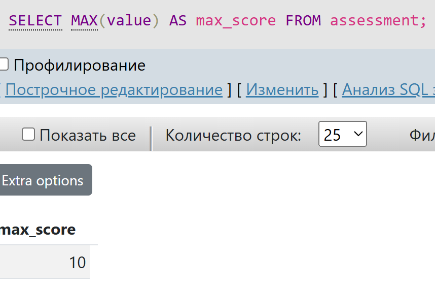
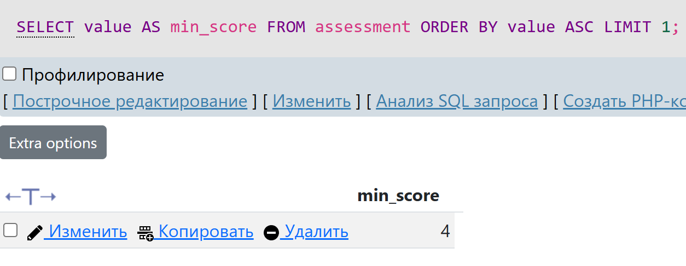

# Database

# Вариант 19. Конкурс с индивидуальным участием и оценкой жюри.

## Part 1. Разработка реляционной модели данных согласно предметной области и ее реализация на сервере MySQL

#### 1.1 Экспорт базы данных

Файл с экспортированной базой данных находится в директории "Code".

#### 1.2 Структура базы данных

## Part 2. Выполнение простых SQL-запросов. Соединение таблиц

#### 2.1 Запрос на выбор всех данных из таблицы

#### 2.2 Запрос на выбор определенных полей (столбцов) из таблицы

#### 2.3 Запрос на выбор строк, соответствующих определенному условию WHERE с использованием операторов сравнения > < =

#### 2.4 Запрос на выбор строк, соответствующих определенному условию WHERE с использованием LIKE

#### 2.5 Запрос с использованием сортировки строк результата ORDER BY

#### 2.6 Запрос с использованием ограничения на количество выводимых строк ORDER BY ... LIMIT

#### 2.7 Запрос, получающий декартово произведение связанных таблиц

#### 2.8 Запрос, получающий соединение связанных таблиц по ключу

## Part 3. Выполнение запросов с использованием агрегатных функций и оператора группировки

#### 3.1 Запрос на подсчет количества строк в таблице, удовлетворяющих заданному условию (COUNT)

#### 3.2 Запрос на подсчет среднего значения в каком-либо столбце таблицы (AVG)

#### 3.3 Запрос на подсчет суммы значений какого-либо столбца с таблице (SUM)

#### 3.4 Запрос на нахождение максимального значения в столбце таблицы (MAX)

#### 3.5 Запрос на нахождение минимального значения в столбце таблицы (MIN)

#### 3.6 Запрос на нахождение минимального значения в столбце таблицы без использования функции MIN, применяя ORDER BY и LIMIT

#### 3.7 Запрос на нахождение максимального значения в столбце таблицы без использования функции MAX, применяя ORDER BY DESC и LIMIT

#### 3.8 Запрос с группировкой строк и подсчетом значения любой агрегатной функции по каждой группе (GROUP BY). Сформулировать и записать описание полученного результата с точки зрения предметной области

Для каждого участника выводится средний балл по всем выставленным ему оценкам

#### 3.9 Запрос с соединением не менее, чем 2-х таблиц, группировкой строк и подсчетом значения любой агрегатной функции по каждой группе (GROUP BY). Сформулировать и записать описание полученного результата с точки зрения предметной области

Для каждого конкурса выводится средний балл по всем оценкам участников этого конкурса

#### 3.10 Любой запрос с использованием вложенного подзапроса SELECT. Сформулировать и записать описание полученного результата с точки зрения предметной области

Выводятся участники, у которых средний балл по оценкам выше среднего балла по всем участникам.

## Part 4. Выполнение SQL-запросов согласно индивидуальному варианту задания

#### 4.1 Подсчитать средний балл по каждому конкурсу

#### 4.2 Подсчитать количество участников в каждом конкурсе

#### 4.3 Для каждого члена жюри подсчитать средний балл, который он выставил

